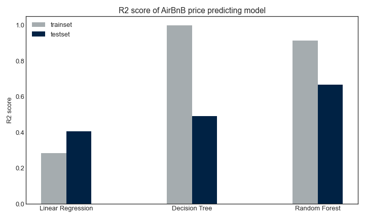

# Analyze AirBnB data scrapped on Jan 15, 2020
## Library use:
- `numpy, pandas, matplitlib`: to work array, dataframe and visualization
- `folium`: visualization data over map
- `sklearn`: for preprocessing, machine learning model and evaluation 
- The raw data is inside `2020Jan` folder
- The `img` contains some of the graphs from the analysis

# A high level summary is posted on Medium
[Downtown is expensive, and more in weekends and summer time: an analysis of AirBnB data in Seattle](https://binhng.medium.com/downtown-is-expensive-and-more-in-weekends-and-summer-time-an-analysis-of-airbnb-data-in-seattle-ce784bc71583)

## Some findings:
- Average listing price over Seattle during Jan 15, 2020 is about $170 plus fees and taxes. The price distribution is right-skewed with a few listing with a really high price. A few of them at $1000, even one with $9999.

    

- itemize price per room (or per bed, more in the Notetebook), show a more expensive option in Downtown area, and below $100 price tag for further away neighborhoods.

    

- Listing price is higher in during summer time in June to August, and bit more during the weekend, and much more expensive in Downtown area. The price is marking in advance. So it is not a sure bet that price will be the same when actually listing is valid.
- Price change by month in 2020 (in advance) in Downtown, Seattle.

    

- The same pattern but with a smaller magnitude in Magnolia neighborhood

    

- Building a predictive price model is not promissing as I hope with R2 score from 0.4 to 0.6. The R2 score on traning set is varied on model, and overfitted with DecisionTree model (very usual).

    

- One area of improvement is to remove outliers on  price. Some duplicated columns in nature should be dropped so that the model is well-balanced with other relevant features of a listing.

## Motivation
- A cannonical of machine learning is California Housing Price project. AirBnB datase with listing price is identical but it contains more rows and columns, and more messy one.
- From data scapped by [insideairbnb.com], an independent and non-commerical website, each datashet contains 3 files `listing.csv.gz`, `calendar.csv.gz`, and `reviews.csv.gz`. The dataset presented a "snapshot" of AirBnB listing price on that day. To analyze trend for longer terms, we need to analyze data from `reviews.csv` and `calendar.csv`
- COVID-19 is somewhere in the picture to know how the pandemic affect the travel and renting business. The current analysis provides a framework to analyze price, but have not address the effect of COVID-19 on AirBnB pricing and listing.

# Credits:
- StackOverflow is a great resource to check out a short code for a complex problem
- Sklearn document is great to have a sense how the model is applied
- Kaggle notebooks associated AirBnB 2016 dataset is a right place to start. The notebook gives a sense of scope and aspect of the analysis
- Last but not least: insideairbnb.com for prepare the raw data.
